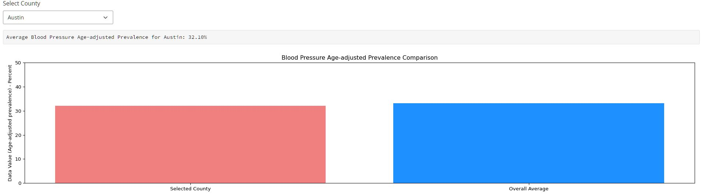
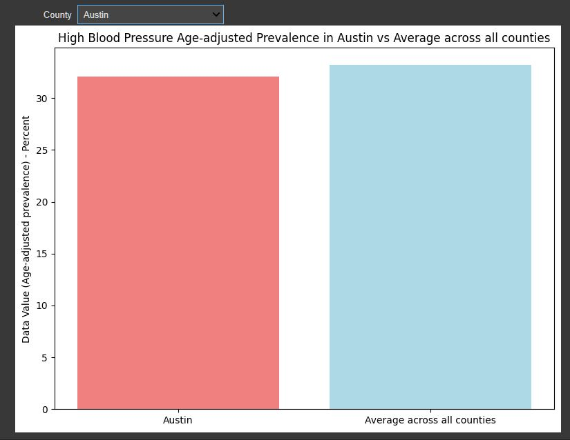

# datasci_4_web_vi
This is a repository for Assignment 4 in HHA507. 

# R's Shiny Visualization
[Shiny App](https://aeg17i-jason-tang.shinyapps.io/texas_bp/)

For this application, it was different to work with R instead of Python. I used the Posit Cloud environment to build this app to be hosted on Shinyapp.io. 
I first downloaded the PLACES: Local Data for Better Health, County Data 2023 release CSV file from the CDC website. I then filtered the CSV files to only
contain data from the state, Texas. I did so by uploading the CSV file onto a google colab notebook, and applying a filter and explorting it. 
```
# Filter for 'BPHIGH' as measureid
df = df[(df['StateAbbr'] == 'TX')]
df.to_csv('texascdc.csv')
```
Then, on the posit.cloud workspace, I followed the guidelines provided by Professor Williams to create a working application.
```
# Import necessary libraries
library(shiny)
library(ggplot2)
library(dplyr)

# UI for the Shiny app
ui <- fluidPage(
  titlePanel("High Blood Pressure Age-adjusted Prevalence in TX by County"),
  sidebarLayout(
    sidebarPanel(
      selectInput("county", "Choose a county:", choices = NULL)
    ),
    mainPanel(
      plotOutput("barPlot")
    )
  )
)

# Server logic
server <- function(input, output, session) {
  
  # Load the dataset
  df <- reactive({
    url <- "https://raw.githubusercontent.com/jas-tang/datasci_4_web_vi/main/data/texascdc.csv"
    read.csv(url)
  })
  
  # Filter the dataset
  df_binge <- reactive({
    data <- df()
    filter(data, MeasureId == "BPHIGH", Data_Value_Type == "Age-adjusted prevalence")
  })
  
  # Update county choices dynamically based on dataset
  observe({
    binge_data <- df_binge()
    updateSelectInput(session, "county", choices = sort(unique(binge_data$LocationName)))
  })
  
  # Render the bar plot
  output$barPlot <- renderPlot({
    binge_data <- df_binge()
    county_data <- binge_data[binge_data$LocationName == input$county, ]
    avg_value <- mean(binge_data$Data_Value, na.rm = TRUE)
    
    ggplot() +
      geom_bar(data = county_data, aes(x = LocationName, y = Data_Value, fill = LocationName), stat = "identity") +
      geom_hline(aes(yintercept = avg_value), linetype = "dashed", color = "dodgerblue") +
      labs(title = 'High Blood Pressure Age-adjusted Prevalence',
           y = 'Data Value (Age-adjusted prevalence) - Percent',
           x = 'Location (County)') +
      theme(axis.text.x = element_text(angle = 90, hjust = 1)) +
      ylim(0, 50) +
      scale_fill_manual(values = c("lightcoral", "dodgerblue"))
  })
  
}

# Run the Shiny app
```
Important things to note are: 
* Importing the required libraries
* Adjusting the titles
* Adjusting the filter MeasureId == "BPHIGH"
* Adjusting ggplot() ylim or limitation to (0,50) to accomdate my data that contained values reaching above the original set 30

Afterwhich, I went to my shinyapps.io account to find the token for my account. I used rsconnect to link my shinyapps account to my posit.cloud. 
```
rsconnect::setAccountInfo(name=<'NAME'>, token=<'TOKEN'>, secret=<'SECRET'>)
```
Then I used rsconnect deploy shiny to deploy my app on shinyapps.io. 
```
rsconnect deploy shiny /path/to/app --name <aeg17i-jason-tang> --title texas-bp
```


# Python's Shiny Visualization
I went to google cloud to create a python app using Shiny as a package. I followed Professor Williams' example to create my app. The code is the following: 
```
from shiny import App, render, ui
import matplotlib.pyplot as plt
import pandas as pd

# Load the dataset
def load_data():
    url = "https://raw.githubusercontent.com/jas-tang/datasci_4_web_vi/main/data/texascdc.csv"
    return pd.read_csv(url)

df = load_data()
df_binge = df[(df['MeasureId'] == 'BPHIGH') & (df['Data_Value_Type'] == 'Age-adjusted prevalence')]

# Available counties for selection
counties = df_binge['LocationName'].unique()

app_ui = ui.page_fluid(
    ui.input_select("county", "Select County", {county: county for county in counties}),
    ui.output_text_verbatim("avg_data_value"),
    ui.output_plot("bar_chart")
)

def server(input, output, session):

    @output
    @render.text
    def avg_data_value():
        selected_county = input.county()
        avg_value = df_binge[df_binge['LocationName'] == selected_county]['Data_Value'].mean()
        return f"Average Blood Pressure Age-adjusted Prevalence for {selected_county}: {avg_value:.2f}%"

    @output
    @render.plot(alt="Blood Pressure Age-adjusted Prevalence Bar Chart")
    def bar_chart():
        overall_avg = df_binge['Data_Value'].mean()
        selected_county_avg = df_binge[df_binge['LocationName'] == input.county()]['Data_Value'].mean()

        fig, ax = plt.subplots(figsize=(10, 6))
        ax.bar(['Selected County', 'Overall Average'], [selected_county_avg, overall_avg], color=['lightcoral', 'dodgerblue'])
        
        ax.set_ylabel('Data Value (Age-adjusted prevalence) - Percent')
        ax.set_ylim(0, 50)
        ax.set_title('Blood Pressure Age-adjusted Prevalence Comparison')
        
        return fig


app = App(app_ui, server)
```
Important things to note:
* Importing the necessary packages
* Changing  the filter of MeasureID to 'BPHIGH'
* Changing the dataset URL to accomdate my own data
* Changing the ax.set_ylim to (0,50) to accomodate my own data
* Changing the appropriate bar titles and names

The application ran locally on port 8000. 



# Flask App
[Flask App](https://texasbp507.azurewebsites.net/)
Using Google Cloud, I created a Flask application using Python. I followed Professor Williams' example to create my app. The base code is the following:
```
from flask import Flask, render_template, request
import pandas as pd
import matplotlib
matplotlib.use('Agg') # required for local development and g-shell
import matplotlib.pyplot as plt
import io
import base64

import warnings
warnings.simplefilter("ignore", UserWarning)

app = Flask(__name__)

# Load the dataset
url = "https://raw.githubusercontent.com/jas-tang/datasci_4_web_vi/main/data/texascdc.csv"
df = pd.read_csv(url)
df_binge = df[(df['MeasureId'] == 'BPHIGH') & (df['Data_Value_Type'] == 'Age-adjusted prevalence')]

@app.route('/', methods=['GET', 'POST'])
def index():
    counties = sorted(df_binge['LocationName'].unique())
    selected_county = request.form.get('county') or counties[0]
    
    img = create_plot(selected_county)
    
    return render_template("index.html", counties=counties, selected_county=selected_county, img=img)

def create_plot(county):
    overall_avg = df_binge['Data_Value'].mean()
    selected_county_avg = df_binge[df_binge['LocationName'] == county]['Data_Value'].mean()

    fig, ax = plt.subplots(figsize=(10, 6))
    ax.bar(['Selected County', 'Overall Average'], [selected_county_avg, overall_avg], color=['lightcoral', 'dodgerblue'])
    ax.axhline(selected_county_avg, color='gray', linestyle='dashed', alpha=0.7)
    ax.set_ylabel('Data Value (Age-adjusted prevalence) - Percent')
    ax.set_ylim(0, 50)
    ax.set_title('High Blood Pressure Age-adjusted Prevalence Comparison in TX')
    
    # Convert plot to PNG image
    img = io.BytesIO()
    plt.savefig(img, format='png')
    img.seek(0)
    
    return base64.b64encode(img.getvalue()).decode()

if __name__ == '__main__':
    app.run(debug=True)
```
With the index being: 
```
<!DOCTYPE html>
<html>
<head>
    <title>Flask High Blood Pressure App</title>
</head>
<body>

<h2>High Blood Pressure Age-adjusted Prevalence in TX by County</h2>

<form method="post">
    <select name="county" onchange="this.form.submit()">
        
        <option value="{{ county }}"  selected >{{ county }}</option>
        
    </select>
</form>


</body>
</html>
```
Important things to note: 
* Importing that necessary packages
* Changing  the filter of MeasureID to 'BPHIGH'
* Changing the dataset URL to accomdate my own data
* Creating a requirements.txt file and list the required packages
* In the requirements file, I was not able to list the package io, making me assume base34 and warnings would not work either due to their nature

I then connected my google cloud session to my Microsoft Azure account using the following code: 
```
curl -sL https://aka.ms/InstallAzureCLIDeb | sudo bash
```
Then I logged in with: 
```
az login --use-device-code
```
Next, I created my app with: 
```
az webapp up --resource-group <groupname> --name <app-name> --runtime <PYTHON:3.9> --sku <B1>
```
# Locally Using ipywidgets and matplotlib
First I imported the necessary libraries. 
```
# Import necessary libraries
import pandas as pd
import matplotlib.pyplot as plt
import ipywidgets as widgets
```
Then I filtered my dataframe even further. 
```
df = df[(df['MeasureId'] == 'BPHIGH') & (df['Data_Value_Type'] == 'Age-adjusted prevalence')]
```
Next, group by the location name and get their averages. 
```
# Group by 'LocationName' and get the average (or sum) 'Data_Value'
grouped = df.groupby('LocationName').Data_Value.mean().sort_values(ascending=False)
grouped
```
Then, use matplotlib to create a figure. 
```
# Plotting
plt.figure(figsize=(30, 7))
grouped.plot(kind='bar', color='lightcoral')
plt.ylabel('Average Data Value (Age-adjusted prevalence) - Percent')
plt.xlabel('Location (County)')
plt.title('High Blood Pressure Age-adjusted Prevalence by County in TX')
plt.xticks(rotation=90)
plt.tight_layout()
plt.savefig("high_bp_location.png")  # Saving the plot as an image
plt.show()
```
Finally, use ipywidgets to create an interactive chart. 
```
# Compute the average data value across all counties
avg_data_value = df['Data_Value'].mean()

# Sort the counties in ascending order for the dropdown list
sorted_counties = sorted(df['LocationName'].unique())

# Interactive selection of county for visualization using ipywidgets
@widgets.interact(County=sorted_counties)
def plot_data(County):
    county_value = df[df['LocationName'] == County]['Data_Value'].values[0]

    # Labels for bars
    labels = [County, 'Average across all counties']

    # Data values for bars
    values = [county_value, avg_data_value]

    plt.figure(figsize=(8, 6))

    # Plot the bars
    colors = ['lightcoral', 'lightblue']
    plt.bar(labels, values, color=colors)

    plt.ylabel('Data Value (Age-adjusted prevalence) - Percent')
    plt.title(f'High Blood Pressure Age-adjusted Prevalence in {County} vs Average across all counties')

    plt.tight_layout()
    plt.show()
```

# Reflections
I found that the easier visualization method was the local method using matplotlib and ipywidgets. While it contained a decent amount of code and steps, it was the easiest to reproduce. 
It wasn't necessary to create any connections due to the lack of need to publish online. 

Python's Shiny Visualization was next on the totem pole of easy to difficult. Again, it ran locally, show there wasn't any need to create a connection. I had a small issue where I could not
use the command git add . for a bit. I learned that I should include the pycacje folder within a gitignore file. I am unsure if this was the solution, but this resolved my issue. 

Next, is using R's Shiny Visualization. After the initial bump of seeing R, it is not too different from python and I was able to read the code. I learned how to naviage through their directory 
using getwd() and setwd(). I found that I wasn't able to deploy my app unless I was within a folder. The app also had to be called app.R. After setting up the connection with rsconnect, it was 
not too difficult to get running. 

Finally, I found that Flask was the most tedious. This is mostly due to setting up the Azure connection. There wre a lot of rules to remember, like being in the correct directory when launching the 
app for the first time. When creating the requirements.txt file, it did not like the package io, so I was left confused. I decided to leave it out, along with base34 and warnings, and the
app ran anyways. Creating and deleting the app to make changes took a lot of time. 

Working with Shinyapps was easier to create the connection, but it is obviously a lot less secure than Microsoft Azure. 
